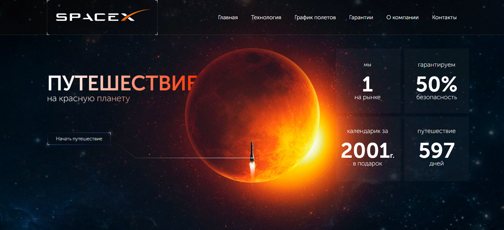

# Тестовое задание: Sagirov.com

Тестовое задание от студии [Sagirov.com](https://sagirov.com/)

## Оглавление

- [Обзор проекта](#обзор-проекта)
  - [Задачи проекта](#задачи-проекта)
  - [Функциональность проекта](#функциональность-проекта)
  - [Screenshot](#screenshot)
  - [Директории проекта](#директории-проекта)
  - [Запуск проекта](#запуск-проекта)
  - [Ссылки](#ссылки)
- [Ход выполнения проекта](#ход-выполнения-проекта)
  - [Используемые технологии](#используемые-технологии)
  - [Чему я научился работая над проектом](#чему-я-научился-работая-над-проектом)
- [Автор](#автор)

## Обзор проекта

### Задачи проекта

Создать первый экран для русскоязычного сайта SpaceX.

### Функциональность проекта

Функционально проект представляет из себя шапку и промо экран для русского сайта компании SpaceX. Проект адаптирован для просмотра на мобильных устройствах. Реализовано бургер-меню для навигации.

Функциональность:

- Бургер меню для навигации

### Screenshot

### Директории проекта

- `src/assets` — директория со статичными файлами
- `src/components` — директория с компонентами
- `src/lib` — директория с файлами библиотек
- `src/pages` — директория с корневыми файлами страниц
и

### Запуск проекта

- `npm run build` — запуск проекта в режиме продакшн, с формированием файлов подготовленных к деплою в директории `/build`
- `npm start` — запуск проекта в режиме разработки

### Ссылки

- [Ссылка на репозиторий проекта](https://github.com/Bjorn86/testing-sagirov-com)
- [Ссылка на демо-страницу проекта](https://bjorn86.github.io/testing-sagirov-com/)

## Ход выполнения проекта

### Используемые технологии

- HTML
- CSS
- JS
- [React](https://react.dev/)
- [React Router](https://reactrouter.com/en/main)
- Адаптивная вёрстка
- Семантическая вёрстка

### Чему я научился работая над проектом

- Вёрстке сложных элементов

## Автор

**Данила Легкобытов**

- e-mail: [legkobytov-danila@yandex.ru](mailto:legkobytov-danila@yandex.ru)
- Telegram: [@danila_legkobytov](https://t.me/danila_legkobytov)
- LinkedIn: [in/danila-legkobytov](https://www.linkedin.com/in/danila-legkobytov/)
